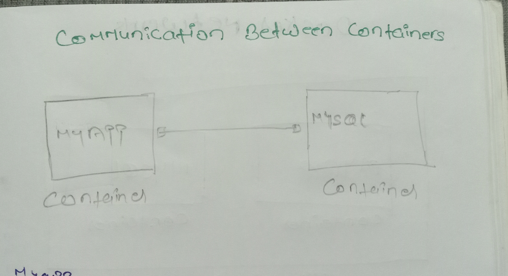

# 🚀 DevOps Docker & Kubernetes Practice


> A hands-on DevOps lab for learning Docker and Kubernetes (K8s) with real-world examples, CI/CD integration, and system orchestration practices.

---

# 🐳 Docker Commands Cheat Sheet

### 🔹 Docker Basics

```bash
docker --version          # Check Docker version
docker info               # Display Docker system-wide information
docker help               # Show help for Docker commands
```

---

## Working with Images

### Show all image

```bash
docker images
docker image ls
```

---

## Build & run Docker Image or Manage Docker Containers

This repository contains a Dockerfile and instructions to build and use a Docker image for your application.

### Build Docker Image

To build the Docker image, run the following command in the root directory where the `Dockerfile` is located:

```bash
docker build .               # Builds the image with an autogenerated ID (no custom name)
docker build -t <image-name> .  # Builds the image and tags it with your custom name
```

#### Description

```
This project shows how to build a Docker image from a Dockerfile using the `docker build` command.

- `docker build`: Command to build a Docker image.
- `-t <image-name>`: Tags the image with a name (e.g., `myapp:latest`).
- `.`: The build context, usually the current directory containing the Dockerfile.

```

#### Example

```bash
docker build -t myapp
```

---

### Use Public Docker Images

To download a public Docker image from Docker Hub, use the `docker pull` command:

```bash
docker pull <image>
```

#### Example

```bash
docker pull mysql
```

---

### Remove Docker Containers

This repository provides quick reference commands for stopping and removing Docker containers and images. Useful for cleaning up your local Docker environment during development or debugging.

To **stop**, **remove**, and **clean up** Docker containers and images:

```bash
# Remove the stopped container
docker rm <container-id>

# Remove the Docker image
docker rmi <image-name-or-id>

# Optional: Remove all unused images, containers, networks, and build cache
docker image prune -a
```

#### Example

```bash
docker rm myapp
docker rmi 230i3u443
docker image prune -a
```

#### 🏷️ Tagging Docker Images

To assign a new name (tag) to an existing Docker image, use:

```bash
docker tag <image> <repository>:<tag>  # Tag image with a new name
```

#### Example

This command tags the local image myapp:latest with a new name myusername/myapp:v1.0, typically used before pushing to Docker Hub or another registry.

```bash
docker tag myapp:latest myusername/myapp:v1.0
```

---

# Working with Containers

## Docker Image: `<image>`

This repository provides a Docker image that you can quickly run using Docker. It is designed for ease of use and quick deployment.

### 📦 Usage

To run the container from the image, use the following command:

```bash
docker run <image>
```

#### Example

```bash
docker run myapp
```

### 📦 Run interactively

```bash
docker run -it <image>
```

#### Description

```
This project shows how to build a Docker image from a Dockerfile using the `docker build` command.

- i: Keep STDIN open even if not attached.
- -t: Allocate a pseudo-TTY '(terminal)'.
- Combined as -it, this allows you to interact with the container via the terminal.

# when you want to run a container and interact with it, e.g., start a shell inside a base image. it's also essential when running a containerized program that requires user input (e.g. read in shell scripts, prompts in Python, etc.).

```

#### Example:

```bash
docker run -it myapp
```

### Run in detached mode

```bash
docker run -d <image>
```

#### Description

```bash
-    -d stands for detached mode.
-    This runs the container in the background and prints the container ID.
```

#### Example:

```bash
docker run -d myapp
```

### inspect process information

List running containers / Shows all currently running Docker containers.

```bash
docker ps
```

#### Output

```bash
    # CONTAINER ID   IMAGE     COMMAND                  CREATED       STATUS          PORTS                    NAMES
    # a1b2c3d4e5f6   nginx     "nginx -g 'daemon       2 hours ago   Up 2 hours   0.0.0.0:8080->80/tcp       my-nginx
```

List all containers / To list all containers (running and stopped) Includes containers that have exited, been stopped, or failed.

```bash
docker ps -a
```

#### Output

```bash
    # CONTAINER ID   IMAGE       COMMAND                  CREATED       STATUS          PORTS                    NAMES
    # a1b2c3d4e5f6   nginx     "nginx -g 'daemon       2 hours ago   Up 2 hours   0.0.0.0:8080->80/tcp         my-nginx
    # CONTAINER ID   IMAGE       COMMAND                  CREATED       STATUS          PORTS                    NAMES
    # a1b2ch42e5f6   mysql     "mysql -g 'daemon       3 hours ago   Up 3 hours   0.0.0.0:8080->80/tcp         my-mysql
```

### Start a container, Stop a running container, Restart a running container, Remove a container

```bash
docker stop <container>        # Stop a running container / Stops a running container gracefully. You can use the container ID or name.
docker start <container>       # Start a stopped container / Starts a container that was previously stopped.
docker restart <container>     # Restart a container/Stops and then starts the container again. applying changes like updated environment variables or configs.
docker rm <container>          # Remove a container / Removes a stopped container from your system.
```

#### Example:

```bash
docker start myapp
docker stop myapp
docker restart myapp
docker rm myapp
```





## 💾 Docker Volumes & Networks (Using `myapp`)

### 📦 Create and Use a Volume

Create a Docker volume:

```bash
docker volume create mydata
```

Run your container with the volume mounted:

```bash
docker run -d -v mydata:/app/data myapp
```

> This mounts the volume `mydata` to the `/app/data` directory inside the `myapp` container.

List all volumes:

```bash
docker volume ls
```

---

### 🌐 Create and Use a Custom Network

List existing networks:

```bash
docker network ls
```

Create a custom network:

```bash
docker network create my-network
```

Run your container in the custom network:

```bash
docker run -d --network my-network --name myapp-container myapp
```

> This connects `myapp` to `my-network` and names the container `myapp-container`.

---

### 🧼 (Optional) Clean Up

Remove a volume:

```bash
docker volume rm mydata
```

Remove a network:

```bash
docker network rm my-network
```

---

## 📘 Docker Compose Command

A categorized reference for using **Docker Compose** to manage multi-service applications.

---

### 🔧 Build Commands

| Task                      | Command                           |
| ------------------------- | --------------------------------- |
| Build all services        | `docker-compose build`            |
| Build without using cache | `docker-compose build --no-cache` |
| Build and start services  | `docker-compose up --build`       |

---

### 🚀 Starting Services

| Task                                | Command                                   |
| ----------------------------------- | ----------------------------------------- |
| Start all services                  | `docker-compose up`                       |
| Start in background (detached mode) | `docker-compose up -d`                    |
| Start specific services             | `docker-compose up <service1> <service2>` |

---

### ⏹ Stopping & Removing

| Task                             | Command                                   |
| -------------------------------- | ----------------------------------------- |
| Stop all services                | `docker-compose down`                     |
| Stop and remove volumes + images | `docker-compose down --volumes --rmi all` |

---

### 🔁 Restarting Services

| Task                    | Command                          |
| ----------------------- | -------------------------------- |
| Restart all services    | `docker-compose restart`         |
| Start a stopped service | `docker-compose start <service>` |
| Stop a running service  | `docker-compose stop <service>`  |

---

### 🧪 Run & Exec

| Task                                     | Command                                   |
| ---------------------------------------- | ----------------------------------------- |
| Run one-off command in a new container   | `docker-compose run <service> <command>`  |
| Exec into a running container            | `docker-compose exec <service> <command>` |
| Example: Enter bash shell in a container | `docker-compose exec <service> bash`      |

---

### 📜 Logs & Status

| Task                     | Command                  |
| ------------------------ | ------------------------ |
| View container status    | `docker-compose ps`      |
| View service logs        | `docker-compose logs`    |
| Follow logs in real-time | `docker-compose logs -f` |

---

### 📚 Resources

- 📖 [Docker Compose Documentation](https://docs.docker.com/compose/)
- 📦 [Docker CLI Reference](https://docs.docker.com/engine/reference/commandline/compose/)

---

## 📚 What You'll Learn

- ✅ Core Docker concepts (images, containers, networks, volumes)
- ✅ Writing and optimizing Dockerfiles
- ✅ Using Docker Compose for multi-service apps
- ✅ Kubernetes essentials (Pods, Deployments, Services, ConfigMaps)
- ✅ Running Kubernetes locally with Minikube
- ✅ CI/CD using GitHub Actions (coming soon)
- ✅ Helm basics (optional, coming soon)
- ✅ Container security and monitoring tools (Prometheus, Grafana - planned)

---

## 🧰 Tech Stack

| Tool                | Purpose                     |
| ------------------- | --------------------------- |
| **Docker**          | Containerization engine     |
| **Docker Compose**  | Manage multi-container apps |
| **Kubernetes**      | Container orchestration     |
| **Minikube**        | Local K8s cluster           |
| **kubectl**         | K8s command-line interface  |
| **GitHub Actions**  | CI/CD pipelines             |
| **Helm** (optional) | K8s package manager         |
| **Shell Scripting** | Automation tasks            |

---

## 📁 Folder Structure

```bash
.
├── demo-docker-app/        # Docker basics and examples
├── k8s-manifests/          # Kubernetes YAML manifests
├── cicd-pipelines/         # GitHub Actions workflows
├── assets/                 # Images and visual content
├── projects/               # Sample mini-projects
└── README.md               # This file
```
